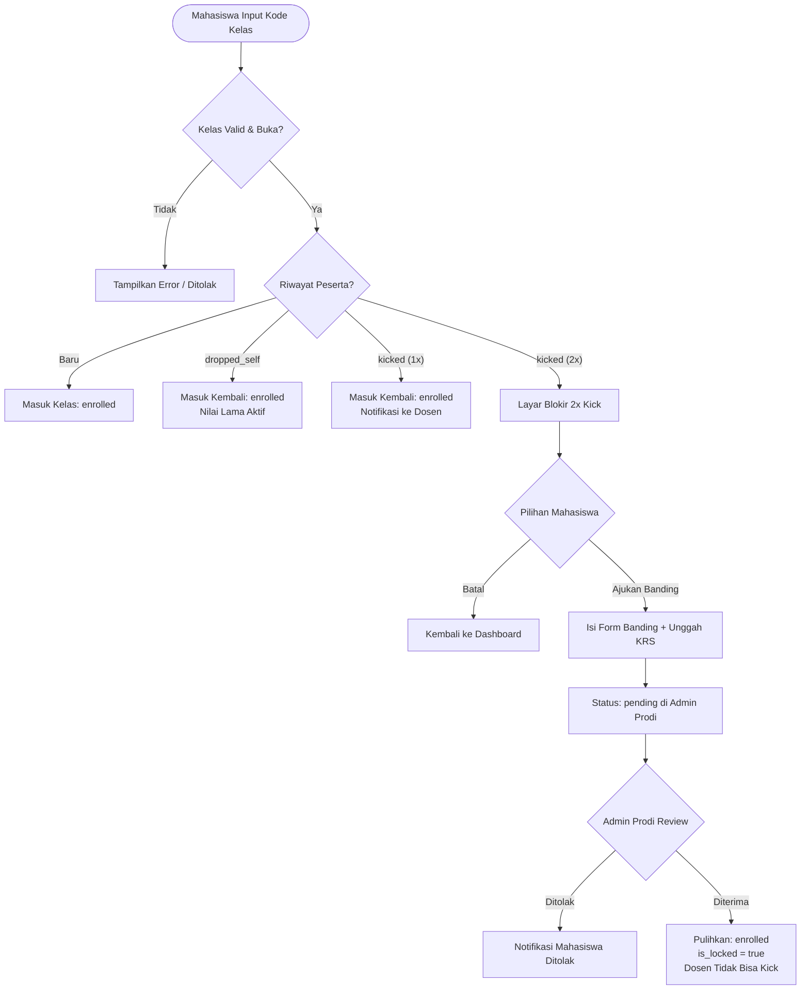

# Product Requirements Document (PRD)
## Manajemen Siklus Hidup Kelas: Pendaftaran, Pengeluaran, Verifikasi Peserta, Arsip & Penghapusan Kelas
**Platform:** SMART ACADEMIC LEARNING ECOSYSTEM (SALE)  
**Versi Dokumen:** 1.0 (Final Approved Specification)  
**Tanggal:** 3 Oktober 2026  
**Status:** Siap Implementasi (Ready for Implementation)  

---

## 1. Pendahuluan & Latar Belakang

### 1.1 Konteks Sistem
SALE adalah platform *Learning Management System* (LMS) berbasis *Outcome-Based Education* (OBE) yang mengintegrasikan perkuliahan daring, penilaian tugas/kuis, serta kalkulasi ketercapaian CPMK (Capaian Pembelajaran Mata Kuliah) dan CPL (Capaian Pembelajaran Lulusan).

### 1.2 Batasan Arsitektur Eksisting
1. **Sistem Mandiri (*Standalone*):** SALE beroperasi secara independen tanpa integrasi langsung (*real-time sync*) ke basis data SIAKAD/KRS kampus.
2. **Pendaftaran Mandiri Mahasiswa:** Mahasiswa bergabung ke kelas menggunakan 8-karakter kode pendaftaran unik (`ClassSection::enrollment_code`) atau tautan langsung `/join-kelas/{code}`.
3. **Verifikasi KRS Manual:** Dosen pengampu memverifikasi keabsahan peserta kelas secara manual dengan mencocokkan data di SALE terhadap berkas cetak presensi atau portal SIAKAD resmi kampus.

### 1.3 Permasalahan yang Diselesaikan
* **Penyusup / Mahasiswa Luar:** Mahasiswa dari kelas paralel lain atau semester bawah yang menyusup ke kelas untuk mencuri materi atau bocoran soal sebelum kelas mereka dimulai.
* **Kucing-Kucingan Re-Join:** Mahasiswa yang dikeluarkan dosen tetapi dapat langsung masuk kembali seenaknya menggunakan kode kelas publik.
* **Potensi *Abuse* / Sentimen Dosen:** Dosen yang tidak bertanggung jawab menge-kick mahasiswa resmi sehingga data nilai mahasiswa hilang atau tersembunyi dari rekapitulasi OBE.
* **Distorsi Statistik OBE:** Mahasiswa yang keluar di tengah jalan merusak rata-rata kelas dan persentase kelulusan CPMK jika datanya dicampuradukkan dengan peserta aktif.
* **Birokrasi Berlebih:** Menghindari keharusan persetujuan Admin Prodi untuk operasional harian dosen, namun tetap menyediakan jalur hukum/sanggahan jika terjadi sengketa.
* **Kebersihan Antarmuka (*Anti-AI Slop*):** Mengeliminasi elemen visual norak (*glowing neon dots*, *rainbow pills*, badge warna-warni berlebih) dan mempertahankan desain monokrom/slate khas SALE.

---

## 2. Matriks Peran & Hak Akses (RBAC)

| Aksi / Fitur | Mahasiswa | Dosen Pengampu | Admin Prodi | Admin Sistem |
| :--- | :---: | :---: | :---: | :---: |
| **Join Kelas via Kode** | Ya (Maks. 2x kick) | Ya (Lead/Asst) | — | — |
| **Leave Kelas Mandiri** | Ya | — | — | — |
| **Kick Mahasiswa dari Kelas** | — | Ya (Wajib alasan, kecuali `is_locked`) | Ya (Wewenang penuh) | Ya |
| **Ajukan Banding (Verifikasi)** | Ya (Setelah 2x kick) | — | — | — |
| **Review & Putusan Banding** | — | — | Ya (Terima/Tolak) | Ya |
| **Lihat Kelas Arsip** | Ya (Read-only) | Ya (Read-only) | Ya (Read-only) | Ya |
| **Arsipkan / Buka Arsip Kelas**| — | — | Ya (Manual/Otomatis) | Ya |
| **Hapus Kelas Kosong** | — | — | Ya | Ya |
| **Hapus Kelas Bernilai** | — | — | Ditolak (Wajib Arsip) | Ditolak |

---

## 3. Spesifikasi Skema Database & Model Data

### 3.1 Perubahan Tabel Pivot `class_section_student`
Tabel relasi many-to-many antara `class_sections` dan `users` dimodifikasi:

```sql
ALTER TABLE class_section_student
    ADD COLUMN status ENUM('enrolled', 'dropped_self', 'kicked') NOT NULL DEFAULT 'enrolled' AFTER mahasiswa_id,
    ADD COLUMN kick_count TINYINT UNSIGNED NOT NULL DEFAULT 0 AFTER status,
    ADD COLUMN kicked_at TIMESTAMP NULL AFTER kick_count,
    ADD COLUMN kicked_by BIGINT UNSIGNED NULL AFTER kicked_at,
    ADD COLUMN kick_reason VARCHAR(255) NULL AFTER kicked_by,
    ADD COLUMN dropped_at TIMESTAMP NULL AFTER kick_reason,
    ADD COLUMN is_locked BOOLEAN NOT NULL DEFAULT FALSE AFTER dropped_at,
    ADD CONSTRAINT fk_css_kicked_by FOREIGN KEY (kicked_by) REFERENCES users(id) ON DELETE SET NULL;
```

**Definisi Kolom:**
* `status`: 
  * `enrolled`: Mahasiswa aktif mengikuti kelas.
  * `dropped_self`: Mahasiswa mengundurkan diri/keluar atas kehendak sendiri.
  * `kicked`: Mahasiswa dikeluarkan oleh dosen pengampu.
* `kick_count`: Menghitung berapa kali mahasiswa dikeluarkan dari kelas ini (0, 1, 2).
* `kicked_at`: Waktu eksekusi pengeluaran terakhir.
* `kicked_by`: ID Dosen yang mengeksekusi pengeluaran.
* `kick_reason`: Alasan resmi yang diinput oleh dosen saat mengeluarkan mahasiswa.
* `dropped_at`: Waktu mahasiswa menekan tombol keluar mandiri.
* `is_locked`: Bernilai `true` jika mahasiswa telah divalidasi/dipulihkan oleh Admin Prodi. Dosen **dilarang keras** menge-kick mahasiswa dengan `is_locked = true`.

---

### 3.2 Tabel Baru: `class_enrollment_appeals` (Permohonan Verifikasi Peserta)
Tabel untuk mencatat permohonan banding dari mahasiswa yang telah dikeluarkan 2 kali:

```sql
CREATE TABLE class_enrollment_appeals (
    id BIGINT UNSIGNED AUTO_INCREMENT PRIMARY KEY,
    class_section_id BIGINT UNSIGNED NOT NULL,
    mahasiswa_id BIGINT UNSIGNED NOT NULL,
    status ENUM('pending', 'approved', 'rejected') NOT NULL DEFAULT 'pending',
    student_notes TEXT NOT NULL,
    attachment_path VARCHAR(255) NULL,
    reviewed_by BIGINT UNSIGNED NULL,
    reviewed_at TIMESTAMP NULL,
    admin_notes TEXT NULL,
    created_at TIMESTAMP NULL,
    updated_at TIMESTAMP NULL,
    CONSTRAINT fk_cea_class_section FOREIGN KEY (class_section_id) REFERENCES class_sections(id) ON DELETE CASCADE,
    CONSTRAINT fk_cea_mahasiswa FOREIGN KEY (mahasiswa_id) REFERENCES users(id) ON DELETE CASCADE,
    CONSTRAINT fk_cea_reviewed_by FOREIGN KEY (reviewed_by) REFERENCES users(id) ON DELETE SET NULL,
    INDEX idx_cea_status (status),
    INDEX idx_cea_class_mahasiswa (class_section_id, mahasiswa_id)
);
```

---

### 3.3 Perubahan Tabel `class_sections`
Penambahan status arsip kelas:

```sql
ALTER TABLE class_sections
    ADD COLUMN archived_at TIMESTAMP NULL AFTER learning_payload,
    ADD COLUMN archived_by BIGINT UNSIGNED NULL AFTER archived_at,
    ADD CONSTRAINT fk_cs_archived_by FOREIGN KEY (archived_by) REFERENCES users(id) ON DELETE SET NULL;
```

---

## 4. Alur Bisnis Lengkap (Berdasarkan 7 Kondisi)



---

### KONDISI 1: Mahasiswa Masuk Kelas (Join)

#### 1.1 Pendaftaran Baru (Normal)
* Mahasiswa memasukkan kode kelas 8-karakter pada modal join.
* Sistem memvalidasi:
  1. Kode kelas valid dan terdaftar.
  2. Kelas belum diarsipkan (`archived_at IS NULL`).
  3. Kuota kelas mencukupi (jika kapasitas diatur).
  4. Mahasiswa belum terdaftar aktif.
* Hasil: Baris baru ditambahkan ke `class_section_student` dengan `status = 'enrolled'`, `kick_count = 0`, `is_locked = false`.

#### 1.2 Re-Join Mandiri (Pernah Keluar Sendiri)
* Mahasiswa yang sebelumnya memiliki status `dropped_self` memasukkan kode kelas.
* Sistem mengizinkan pendaftaran langsung:
  * Status diubah kembali menjadi `enrolled`.
  * Waktu `dropped_at` di-reset menjadi `NULL`.
  * Seluruh data asesmen, submisi tugas, jawaban kuis, dan nilai CPMK terdahulu langsung aktif kembali secara transparan.

#### 1.3 Re-Join Pasca Di-Kick Dosen (Aturan 2x Kesempatan)
* **Kasus Kick ke-1 (Kesempatan Kedua):**
  * Mahasiswa yang berstatus `kicked` dengan `kick_count = 1` diizinkan masuk kembali menggunakan kode kelas.
  * Status diubah menjadi `enrolled`.
  * **Sistem Otomatis Mengirim Notifikasi ke Dosen:**  
    `Kategori: sistem`, `Judul: Peserta Bergabung Kembali`, `Pesan: Mahasiswa [Nama] ([NIM]) yang sebelumnya Anda keluarkan telah bergabung kembali ke kelas [Kode Kelas].`
* **Kasus Kick ke-2 (Terkunci):**
  * Jika mahasiswa tersebut dikeluarkan lagi oleh dosen, `kick_count` bertambah menjadi `2`.
  * Mahasiswa dilarang keras masuk kembali menggunakan kode kelas.
  * Saat memasukkan kode kelas, diarahkan ke **Layar Peringatan Khusus** (Lihat Bab 5.1).

---

### KONDISI 2: Mahasiswa Keluar Sendiri (Leave)

#### 2.1 Keluar Saat Belum Memiliki Riwayat Nilai
* Terjadi pada minggu-minggu awal perkuliahan saat mahasiswa salah masuk kelas.
* Sistem memeriksa: Tidak ada rekaman di tabel `submissions`, `student_assessment_scores`, atau `assessment_attempts` untuk mahasiswa ini di kelas terkait.
* Eksekusi: Baris `class_section_student` dihapus secara permanen (*Hard Delete*). Tidak ada jejak yang tersisa.

#### 2.2 Keluar Saat Sudah Memiliki Riwayat Nilai
* Terjadi di pertengahan semester setelah mahasiswa pernah mengumpulkan tugas atau memiliki nilai.
* Sistem memeriksa: Ditemukan rekaman submisi atau skor.
* Eksekusi (*Soft Drop*):
  * Status diubah menjadi `dropped_self`.
  * `dropped_at` diisi timestamp saat ini.
* **Efek ke Rekapitulasi Nilai OBE (Pemisahan Sheet):**
  * **Sheet Utama (Peserta Aktif):** Mahasiswa ini **dikeluarkan** dari tabel peserta aktif agar tidak merusak rata-rata kelas, deviasi standar, maupun persentase kelulusan CPMK.
  * **Sheet Terpisah (Riwayat Peserta Keluar):** Data nilai mahasiswa dicantumkan pada sheet/tabel tersendiri bernama `Riwayat Peserta Non-Aktif` lengkap dengan nilai yang diperoleh sebelum keluar.

---

### KONDISI 3: Dosen Mengeluarkan Mahasiswa (Kick)

#### 3.1 & 3.2 Prosedur Pengeluaran oleh Dosen
1. Dosen membuka modal daftar peserta kelas (`enrolled-students-modal`).
2. Dosen mengklik tombol `Keluarkan` pada baris mahasiswa yang ingin dikeluarkan.
3. Muncul modal konfirmasi standar (bukan teks berwarna berlebih):
   * Pertanyaan konfirmasi nama mahasiswa dan NIM.
   * **Input Wajib Alasan Pengeluaran:** Dosen wajib mengisi alasan (misal: "Bukan mahasiswa kelas paralel A", "Batal KRS", dll.).
4. Saat dosen mengonfirmasi:
   * Status mahasiswa diubah menjadi `kicked`.
   * Kolom `kick_count` dinaikkan (+1).
   * Kolom `kicked_at` diisi timestamp saat ini, `kicked_by` diisi ID dosen, dan `kick_reason` disimpan.
   * **Notifikasi Dikirim ke Mahasiswa:**  
     `Kategori: sistem`, `Judul: Dikeluarkan dari Kelas`, `Pesan: Anda telah dikeluarkan dari kelas [Nama MK] oleh [Nama Dosen]. Alasan: [Alasan Dosen].`
5. **Dampak Nilai:** Jika mahasiswa sudah memiliki nilai, nilainya dipindahkan ke **Sheet Terpisah (Riwayat Peserta Non-Aktif)** di rekapitulasi OBE.

#### 3.3 Proteksi Mahasiswa Terkunci (`is_locked = true`)
* Jika mahasiswa pernah disahkan melalui putusan Admin Prodi (`is_locked = true`):
* Tombol `Keluarkan` pada modal dosen diubah menjadi teks non-interaktif: `🔒 Diverifikasi Admin`.
* Dosen dilarang mengeluarkan mahasiswa ini secara sepihak. Segala perubahan harus melalui Admin Prodi.

---

### KONDISI 4: Interaksi Dosen & UI Sederhana
* Menghilangkan kompleksitas yang tidak dibutuhkan: Tidak perlu toggle manual kunci pendaftaran kelas dan tidak perlu generator kode acak baru.
* Dosen cukup mengandalkan modal konfirmasi pengeluaran yang bersih dan fungsional.

---

### KONDISI 5: Menu "Verifikasi Peserta" (Admin Prodi)

```
[Mahasiswa Kick 2x] ──> [Isi Form Banding] ──> [Masuk Antrean Admin Prodi]
                                                       │
                                   ┌───────────────────┴───────────────────┐
                                   ▼                                       ▼
                         [Tombol: Terima]                        [Tombol: Tolak]
                                   │                                       │
                      • Status kembali 'enrolled'             • Mahasiswa tetap keluar
                      • is_locked = true                      • Catatan penolakan tersimpan
                      • Notifikasi: Diterima                  • Notifikasi: Ditolak
```

1. **Lokasi:** Menu navigasi Admin Prodi ➔ Sub-menu **"Verifikasi Peserta"** di bawah grup Akademik.
2. **Tampilan Tabel Antrean:**
   * Kolom: Waktu Pengajuan, Mahasiswa (Nama & NIM), Kelas & Dosen Pengampu, Alasan Dosen Menge-kick, Pembelaan Mahasiswa, Berkas KRS, Status, dan Tombol Tindakan.
3. **Modal Peninjauan (*Review Modal*):**
   * Admin membaca kronologi: alasan dosen mengeluarkan vs alasan sanggahan mahasiswa.
   * Admin dapat mengeklik tautan berkas lampiran KRS untuk memvalidasi keabsahan jadwal kuliah mahasiswa.
4. **Keputusan Admin Prodi:**
   * **Jika Diterima:**
     * Status relasi `class_section_student` diperbarui: `status = 'enrolled'`, `is_locked = true`.
     * Permohonan banding ditandai `approved`.
     * Mahasiswa otomatis aktif kembali di kelas. Dosen tidak dapat menge-kick mahasiswa ini lagi.
     * Notifikasi dikirim ke mahasiswa: *"Permohonan verifikasi peserta Anda untuk kelas [Nama Kelas] telah DISETUJUI oleh Admin Prodi."*
   * **Jika Ditolak:**
     * Permohonan banding ditandai `rejected`.
     * Admin mengisi catatan penolakan.
     * Mahasiswa tetap berstatus dikeluarkan.
     * Notifikasi dikirim ke mahasiswa: *"Permohonan verifikasi peserta Anda untuk kelas [Nama Kelas] DITOLAK: [Catatan Admin]."*

---

### KONDISI 6: Pengarsipan Kelas (Otomatis & Manual)

#### 6.1 Pengarsipan Otomatis Semester
* Ketika Admin Prodi menonaktifkan suatu semester (mengubah status semester menjadi non-aktif):
* Sistem menawarkan konfirmasi pengarsipan massal:  
  *"Apakah Anda ingin mengarsipkan seluruh kelas pada semester ini secara otomatis?"*
* Jika dikonfirmasi, seluruh `class_sections` dengan `semester_id` tersebut yang belum diarsipkan akan diisi kolom `archived_at = now()`.

#### 6.2 Pengarsipan & Pembukaan Arsip Manual (Unarchive)
* Di halaman Manajemen Kelas Admin Prodi:
  * Tersedia tombol aksi **Arsipkan** untuk kelas individual.
  * Tersedia tombol aksi **Buka Arsip** (*Unarchive*) untuk mengembalikan kelas arsip menjadi aktif kembali jika terjadi revisi perkuliahan.

#### 6.3 Tampilan Tab Arsip untuk Mahasiswa & Dosen
* Di halaman indeks Course (`/mahasiswa/course` dan `/dosen/course`):
* Disediakan tab navigasi:
  * **[Kelas Aktif]** (Default): Menampilkan kelas pada semester berjalan yang belum diarsipkan.
  * **[Arsip Kelas]**: Menampilkan seluruh kelas terdahulu yang telah diarsipkan.
* **Aturan Mode Read-Only pada Kelas Arsip:**
  * Mahasiswa: Tidak dapat mengirim submisi tugas/kuis, tidak dapat keluar dari kelas, hanya dapat membaca materi dan melihat riwayat nilai.
  * Dosen: Tidak dapat menambah/mengedit asesmen, tidak dapat mengedit nilai, tidak dapat menge-kick mahasiswa, tetapi tetap dapat melihat rekap dan mengekspor laporan nilai OBE.

---

### KONDISI 7: Penghapusan Kelas

#### 7.1 Penghapusan Kelas Kosong
* Kelas yang tidak memiliki mahasiswa terdaftar dan tidak memiliki riwayat tugas/nilai dapat dihapus secara permanen oleh Admin Prodi.

#### 7.2 Larangan Penghapusan Kelas Bernilai
* Jika kelas memiliki data keterkaitan akademik (submisi mahasiswa atau nilai yang tersimpan):
* Tombol Hapus **diblokir oleh sistem**.
* Pesan peringatan: *"Kelas ini memiliki riwayat akademik dan tidak dapat dihapus karena akan merusak rekapitulasi OBE. Silakan gunakan fitur Arsipkan Kelas."*

---

## 5. Spesifikasi Tampilan & Antarmuka Pengguna (Anti-AI Slop)

Sesuai filosofi desain SALE, seluruh antarmuka menggunakan komponen monokromatik, tipografi tegas (*Inter*), tata letak bersih, dan **tanpa ornamen visual mencolok** (*no neon glow, no colorful dot pulses, no rainbow pill badges*).

### 5.1 Layar Peringatan 2x Kick (Mahasiswa)
* **Pemicu:** Mahasiswa mencoba join kelas menggunakan kode setelah dikeluarkan 2 kali.
* **Layout:** Card bersih di tengah layar (`surface max-w-lg p-6 rounded-xl border border-line`):
  * **Judul:** `Akses Bergabung Dibatasi` (`font-bold text-ink text-base`)
  * **Deskripsi:** `Anda telah dikeluarkan dari kelas ini sebanyak dua kali oleh dosen pengampu. Harap pastikan kembali apakah ini benar kelas yang tercantum pada Kartu Rencana Studi (KRS) Anda semester ini.` (`text-sm text-muted mt-2 leading-relaxed`)
  * **Pilihan Tombol:**
    * `button-secondary text-xs` : `Batal / Bukan Kelas Saya` (Kembali ke `/mahasiswa/course`).
    * `button-primary text-xs` : `Ajukan Verifikasi Peserta` (Membuka dialog banding).

### 5.2 Modal Formulir Verifikasi Peserta (Mahasiswa)
* **Form Field:**
  1. *Penjelasan / Alasan Sanggahan (Wajib):* Textarea minimal 20 karakter (`field w-full text-xs`).
  2. *Bukti Pendukung / KRS (Opsional):* Input berkas pendukung format PDF/JPG/PNG maks. 2MB.
* **Tombol Aksi:**
  * `button-secondary`: Batal.
  * `button-primary`: Kirim Permohonan.

### 5.3 Tombol "Keluar Kelas" pada Halaman Course Mahasiswa
* **Lokasi:** Di sticky header halaman detail course (`/mahasiswa/course/{id}`), tepat di samping tombol jumlah mahasiswa.
* **Bentuk:** Tombol sekunder minimalis (`button-secondary text-xs font-semibold py-1.5 px-3`):
  * Label: `Keluar Kelas`
* **Modal Konfirmasi:**
  * *Jika belum ada nilai:* "Apakah Anda yakin ingin keluar dari kelas ini? Data pendaftaran Anda akan dihapus."
  * *Jika sudah ada nilai:* "Anda sudah memiliki riwayat tugas dan nilai di kelas ini. Jika keluar, data nilai Anda akan tetap tersimpan di riwayat arsip kelas namun Anda tidak dapat lagi mengikuti aktivitas perkuliahan."

### 5.4 Tombol "Keluarkan" pada Modal Daftar Mahasiswa (Dosen)
* **Lokasi:** Pada setiap baris mahasiswa di `enrolled-students-modal`.
* **Kondisi Normal:**
  * Tautan teks monokrom: `<button type="button" class="text-xs font-medium text-slate-500 hover:text-red-600 transition">Keluarkan</button>`
* **Kondisi Terkunci (`is_locked = true`):**
  * Teks statis abu-abu: `<span class="text-xs font-medium text-slate-400">🔒 Diverifikasi Admin</span>`
* **Modal Konfirmasi Pengeluaran:**
  * Input textarea wajib: `Alasan Pengeluaran` (Contoh placeholder: "Mahasiswa tidak terdaftar pada KRS resmi kelas ini").

### 5.5 Menu "Verifikasi Peserta" (Admin Prodi)
* **Navigasi:** Sidebar Admin Prodi ➔ Grup Akademik ➔ `Verifikasi Peserta`.
* **Status Badge:** Teks netral tanpa warna mencolok:
  * Pending: `Menunggu` (border border-slate-300 text-slate-600 px-2 py-0.5 text-[11px] rounded)
  * Disetujui: `Disetujui` (border border-slate-700 bg-slate-800 text-white px-2 py-0.5 text-[11px] rounded)
  * Ditolak: `Ditolak` (text-slate-400 px-2 py-0.5 text-[11px])

### 5.6 Tampilan Rekap Nilai OBE (Web & Excel Export)
* **Di Halaman Web (`PenilaianController@rekap`):**
  * Terdapat dua tab di atas tabel:
    * `Peserta Aktif (N)`: Menampilkan mahasiswa terdaftar aktif untuk kalkulasi nilai akhir dan pencapaian CPMK.
    * `Riwayat Mahasiswa Keluar (M)`: Menampilkan tabel terpisah untuk mahasiswa dengan status `dropped_self` atau `kicked` yang memiliki riwayat nilai.
* **Di Berkas Ekspor Excel (`.xlsx` via `ObeExcelExportService`):**
  * **Sheet 1 (Rekap Nilai):** Berisi data murni peserta aktif. Formula rata-rata dan ketercapaian CPMK hanya merujuk pada sheet ini.
  * **Sheet 2 (Riwayat Peserta Non-Aktif):** Berisi tabel dokumentasi mahasiswa yang keluar/dikeluarkan berserta skor yang pernah dicapai sebelum keluar.

---

## 6. Arsitektur Rute, Endpoint & Controller

### 6.1 Rute Mahasiswa
```php
// Mahasiswa: Keluar kelas
Route::post('/mahasiswa/course/{course}/leave', [EnrollmentController::class, 'leave'])
    ->name('mahasiswa.course.leave');

// Mahasiswa: Ajukan banding verifikasi peserta
Route::post('/mahasiswa/course/{course}/appeal', [EnrollmentController::class, 'submitAppeal'])
    ->name('mahasiswa.course.appeal');
```

### 6.2 Rute Dosen
```php
// Dosen: Keluarkan mahasiswa dari kelas
Route::post('/dosen/course/{course}/students/{student}/kick', [ClassSectionController::class, 'kickStudent'])
    ->name('dosen.course.students.kick');
```

### 6.3 Rute Admin Prodi
```php
// Admin Prodi: Halaman Verifikasi Peserta (Banding)
Route::get('/admin-prodi/akademik/verifikasi-peserta', [AkademikProdiController::class, 'verifikasiPesertaIndex'])
    ->name('admin-prodi.akademik.verifikasi-peserta');

// Admin Prodi: Terima permohonan banding
Route::post('/admin-prodi/akademik/verifikasi-peserta/{appeal}/approve', [AkademikProdiController::class, 'approveAppeal'])
    ->name('admin-prodi.akademik.verifikasi-peserta.approve');

// Admin Prodi: Tolak permohonan banding
Route::post('/admin-prodi/akademik/verifikasi-peserta/{appeal}/reject', [AkademikProdiController::class, 'rejectAppeal'])
    ->name('admin-prodi.akademik.verifikasi-peserta.reject');

// Admin Prodi: Pengarsipan kelas (manual & buka arsip)
Route::post('/admin-prodi/akademik/kelas/{section}/archive', [AkademikProdiController::class, 'archiveKelas'])
    ->name('admin-prodi.akademik.kelas.archive');
Route::post('/admin-prodi/akademik/kelas/{section}/unarchive', [AkademikProdiController::class, 'unarchiveKelas'])
    ->name('admin-prodi.akademik.kelas.unarchive');

// Admin Prodi: Arsip massal saat semester non-aktif
Route::post('/admin-prodi/akademik/semester/{semester}/archive-classes', [AkademikProdiController::class, 'archiveClassesBySemester'])
    ->name('admin-prodi.akademik.semester.archive-classes');
```

---

## 7. Rencana Rincian Notifikasi Sistem

Semua notifikasi memanfaatkan `DatabaseNotificationService` yang sudah terpasang di SALE:

| Kejadian | Penerima | Judul Notifikasi | Kategori | Ringkasan Pesan |
| :--- | :--- | :--- | :--- | :--- |
| **Mahasiswa Join Pasca Kick 1** | Dosen Pengampu | Peserta Masuk Kembali | `sistem` | Mahasiswa [Nama] bergabung kembali ke kelas [Kode Kelas]. |
| **Dosen Kick Mahasiswa** | Mahasiswa Terkait| Dikeluarkan dari Kelas | `sistem` | Anda dikeluarkan dari kelas [Nama MK]. Alasan: [Alasan]. |
| **Banding Diajukan Mahasiswa** | Admin Prodi | Permohonan Verifikasi Peserta | `sistem` | Mahasiswa [Nama] mengajukan verifikasi untuk kelas [Kode Kelas]. |
| **Banding Disetujui** | Mahasiswa Terkait| Verifikasi Disetujui | `sistem` | Permohonan verifikasi untuk kelas [Nama MK] telah disetujui Admin Prodi. |
| **Banding Ditolak** | Mahasiswa Terkait| Verifikasi Ditolak | `sistem` | Permohonan verifikasi untuk kelas [Nama MK] ditolak. Catatan: [Catatan]. |

---

## 8. Skenario Uji Penerimaan (*Acceptance Criteria*)

1. **Uji Re-Join Pasca Kick 1:**
   * Dosen menge-kick Mahasiswa A dengan alasan "Salah kelas".
   * Mahasiswa A memasukkan kode kelas lagi.
   * **Hasil Diharapkan:** Mahasiswa A berhasil masuk; Dosen menerima notifikasi di dashboard bahwa Mahasiswa A masuk kembali.
2. **Uji Penguncian Pasca Kick 2:**
   * Dosen menge-kick Mahasiswa A untuk kedua kalinya.
   * Mahasiswa A mencoba memasukkan kode kelas.
   * **Hasil Diharapkan:** Sistem menolak pendaftaran langsung dan menampilkan layar peringatan 2x kick dengan opsi Ajukan Banding.
3. **Uji Pengajuan & Putusan Banding:**
   * Mahasiswa A mengisi form banding dan mengunggah kartu KRS.
   * Admin Prodi membuka menu `Verifikasi Peserta` dan menyetujui permohonan.
   * **Hasil Diharapkan:** Mahasiswa A langsung terdaftar kembali di kelas dengan status `is_locked = true`; Tombol kick pada tampilan dosen berubah menjadi `🔒 Diverifikasi Admin`.
4. **Uji Pemisahan Rekap OBE:**
   * Mahasiswa B yang sudah memiliki nilai tugas mengklik `Keluar Kelas`.
   * Dosen membuka halaman Rekap Nilai dan mengunduh Excel.
   * **Hasil Diharapkan:** Nama Mahasiswa B tidak muncul di sheet utama (peserta aktif) dan nilai rata-rata kelas tidak terpengaruh; Nama Mahasiswa B berserta riwayat nilainya tercantum di Sheet 2 (Riwayat Peserta Non-Aktif).
5. **Uji Arsip Semester:**
   * Admin Prodi menonaktifkan Semester Genap 2025/2026 dan memilih arsip otomatis.
   * Mahasiswa dan Dosen membuka tab `Arsip Kelas`.
   * **Hasil Diharapkan:** Semua kelas semester tersebut berpindah ke tab arsip dan dapat diakses dalam mode *Read-Only*.
6. **Uji Proteksi Hapus Kelas:**
   * Admin mencoba menghapus kelas yang memiliki submisi mahasiswa.
   * **Hasil Diharapkan:** Aksi ditolak dengan pesan peringatan untuk menggunakan fitur arsip kelas.

---

## 9. Tahapan Pelaksanaan Implementasi (Roadmap)

* **Tahap 1:** Migrasi Database (Penambahan kolom pada `class_section_student`, `class_sections`, dan tabel `class_enrollment_appeals`).
* **Tahap 2:** Implementasi Logika Join, Re-Join, dan Counter Kick (Aturan 2x kesempatan) di `EnrollmentController` beserta pengiriman notifikasi.
* **Tahap 3:** Implementasi Fitur Leave Mahasiswa dan Kick Dosen (Wajib alasan & validasi `is_locked`).
* **Tahap 4:** Pembuatan Menu & Modul "Verifikasi Peserta" di Admin Prodi (Daftar antrean banding, preview bukti, approval, dan rejection).
* **Tahap 5:** Pemisahan Sheet Rekap Nilai OBE (Web UI & PhpSpreadsheet export).
* **Tahap 6:** Fitur Arsip Otomatis Semester & Tab Switcher `[Kelas Aktif]` / `[Arsip Kelas]` di halaman Course Dosen & Mahasiswa.
* **Tahap 7:** Penyesuaian Proteksi Penghapusan Kelas di `AkademikProdiController`.
